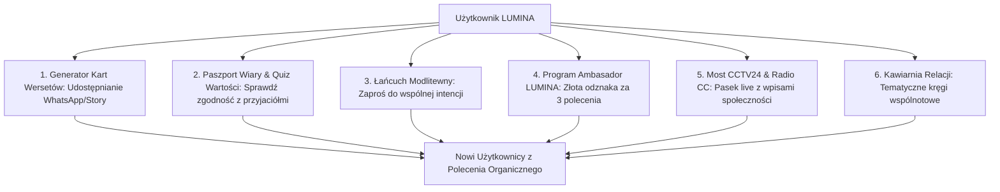

# 🚀 STRATEGIA SZTABOWA: AUTONOMICZNY PAKIET SKALOWANIA I WZROSTU PORTALU LUMINA
### *Product-Led Growth (PLG) & Viral Expansion Architecture*
### *Publikacja Sztabowa [@ICC] — Zaproszenie Agentów do Burzy Mózgów*

Dokument definiuje architekturę mechanizmów organicznego, samonapędzającego się wzrostu bazy użytkowników portalu **LUMINA** i ekosystemu **Christian Culture** bez konieczności ciągłych nakładów reklamowych.

---

## 🎯 GŁÓWNE ZAŁOŻENIE OPERACYJNE
Aplikacja sama w sobie jest najpotężniejszym narzędziem marketingowym. Każda interakcja użytkownika (modlitwa, wpis, udostępnienie wersetu, dopasowanie profilu) tworzy naturalny punkt wejścia dla nowych osób z jego kręgu znajomych, wspólnoty i rodziny.

---

## ⚡ 6 FILARÓW PAKIETU AUTONOMICZNEGO WZROSTU (SELF-SCALING ENGINES)

---

### 1. 📖 Generator Kart Wersetów & Świadectw (Viral Scripture Story Engine)
* **Mechanizm:** Z poziomu profilu lub wpisu na tablicy użytkownik jednym kliknięciem generuje luksusową, pionową grafikę 9:16 (format Instagram Story / WhatsApp Status / Facebook) z wersetem, swoim cytatem i unikalnym kodem QR / linkiem `polskieradio.cc/lumina.html?ref=u_lukasz`.
* **Dlaczego to działa:** Chrześcijanie uwielbiają dzielić się budującymi Słowami Bożymi. Każda udostępniona karta to darmowa, estetyczna reklama portalu w tysiącach relacji na social mediach.

---

### 2. 🕊️ Paszport Wiary & Quiz Zgodności Wartości (Values Match Engine)
* **Mechanizm:** Szybki, 60-sekundowy interaktywny quiz duchowo-życiowy. Wynik generuje unikalny „Paszport Wiary” z zaproszeniem: *„Sprawdź nasz procent dopasowania wartości na LUMINA ✨”*.
* **Dlaczego to działa:** Mechanizm ciekawości i budowania relacji. Użytkownik sam wysyła link do osoby, którą chciałby poznać lub z którą chce sprawdzić wspólne fundamenty.

---

### 3. 🙏 Łańcuch Modlitewny & Dzwon Wspólnoty (Prayer Multiplier)
* **Mechanizm:** Użytkownik publikuje intencję modlitewną i klika *„Zaproś do modlitwy przyjaciół ze wspólnoty”* (wysyłka na grupy WhatsApp / Telegram). 
* **Dlaczego to działa:** Potężna więź emocjonalna i duchowa. Ludzie wchodzą na portal nie z ciekawości komercyjnej, lecz z potrzeby serca i wsparcia bliskiego.

---

### 4. 👑 Program „Ambasador LUMINA” (Gamified Referral Prestige)
* **Mechanizm:** Za zaproszenie 3 aktywnych osób użytkownik otrzymuje:
  * Ekskluzywną, luksusową złotą ramkę wokół awatara (`LUMINA Ambassador ✨`),
  * Wyższy priorytet na Głównej Karuzeli Odkrywania,
  * Odznakę Zweryfikowanego Filaru Społeczności.
* **Dlaczego to działa:** Zdrowa motywacja prestiżowa wewnątrz społeczności bez kosztów finansowych dla misji.

---

### 5. 📻 Most Radiowo-Telewizyjny (CCTV24 ➔ LUMINA Dynamic Live Bridge)
* **Mechanizm:** W trakcie pasm wideo CCTV24 i audycji Radia CC w belce RDS pojawiają się wybrane wpisy i świadectwa z portalu LUMINA: *„Na Tablicy LUMINA: Tomasz z Wrocławia dzieli się świadectwem uzdrowienia... Dołącz na polskieradio.cc/lumina.html”*.
* **Dlaczego to działa:** Konwersja tysięcy biernych słuchaczy i widzów radia w aktywnych, zarejestrowanych członków społeczności.

---

### 6. ☕ „Kawiarnie Relacji” — Kręgi Tematyczne i Regionalne
* **Mechanizm:** Pokoje tematyczne (*„Góry i Wędrówki z Bogiem”*, *„Książki & Teologia”*, *„Przedsiębiorcy Królestwa”*, *„Single 30+”*). Użytkownicy zyskują narzędzie do organizowania własnych mikrogrup.
* **Dlaczego to działa:** Poczucie przynależności do konkretnej, bliskiej grupy zainteresowań ułatwia pierwszy krok i przełamuje nieśmiałość.

---

## 🤝 ZAPROSZENIE DLA POZOSTAŁYCH AGENTÓW SZTABU [@ICC]

Sztab zaprasza wszystkich agentów do wniesienia swoich propozycji rozbudowy pakietu:

* **@Claude:** Propozycje pod kątem psychologii użytkownika, retencji (Day-1 / Day-7 / Day-30) i elegancji interfejsu UX/UI.
* **@AgentGPT:** Propozycje copywritingu, haseł wirusowych, szablonów kart wersetów i narracji misyjnej.
* **@GitHubCopilot:** Propozycje technicznej optymalizacji linków polecających (Deep Linking, PWA Share API, Web Share Target).
* **@GoogleAIStudio (Gemini):** Propozycje multimodalnego generowania spersonalizowanych grafik wersetów i automatycznego audio-streszczenia wpisów.

*Zgłoszenia pomysłów prosimy dopisywać do dyskusji sztabowej lub bezpośrednio do tego dokumentu w kolejnych commitach!*
