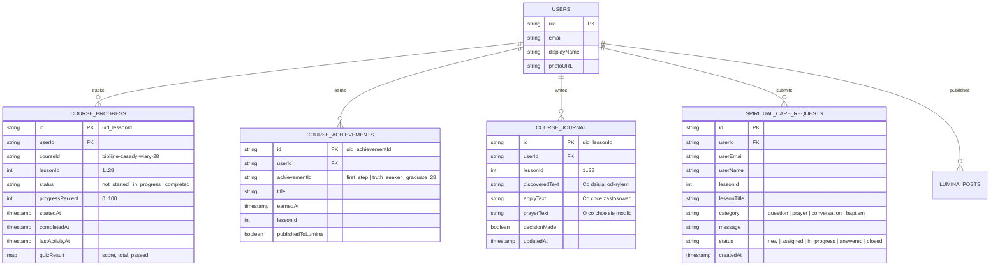

# ARCHITEKTURA SYSTEMU: LUMINA BIBLE ACADEMY
## Kompletny Master Blueprint dla Ekosystemu Christian Culture / LUMINA (`polskieradio.cc/kursy`)

**Status:** ARCHITEKTURA ZATWIERDZENIOWA (Phase 0 Ground Truth Audit)  
**Adres produkcyjny:** `https://polskieradio.cc/kursy`  
**Host produkcyjny:** Cloudflare Pages (Projekt: `polskieradio`)  
**Baza danych i tożsamość:** Firebase Projekt `lumina-cc` (Single Source of Truth)  
**Zasada nadrzędna:** **REUSE > EXTEND > CREATE NEW** (Zero równoległych baz użytkowników, zero atrap).

---

## 1. ZASADY FUNDAMENTALNE ARCHITEKTURY

1. **JEDNA TOŻSAMOŚĆ (CC ID / LUMINA):** Użytkownik logujący się do Akademii Biblijnej używa tego samego konta Google / Firebase `lumina-cc`, które działa na `polskieradio.cc`, `polskieradio.cc/lumina`, `cclite.pl` oraz `polskieradio.cc/holos`. Żadnego nowego ekranu rejestracji ani osobnej tabeli kont.
2. **ZERO ATRAP (Truthful UI):** Jeśli funkcja jest widoczna, wykonuje rzeczywistą operację w Firestore lub Web API. Zapisywanie postępu, quizu, notatki czy zgłoszenia do opiekuna posiada stany: `Zapisywanie…` → `Zapisano` lub `Błąd zapisu — spróbuj ponownie`.
3. **PRYWATNOŚĆ DOMYŚLNA (Private by Default):**
   - Dziennik drogi (refleksje, notatki) oraz decyzje duchowe są dostępne **wyłącznie dla autora** (`request.auth.uid == resource.data.userId`).
   - Zgłoszenia do opiekuna duchowego nie trafiają na publiczną tablicę i są widoczne tylko dla autora oraz uprawnionego opiekuna/administratora.
   - Publikacja osiągnięcia na Tablicy LUMINA następuje **wyłącznie po świadomej zgodzie użytkownika**.
4. **DOSTĘPNOŚĆ BEZ LOGOWANIA:** Każdy gość może czytać lekcje, słuchać TTS i rozwiązywać quizy bez rejestracji (dane sesyjne w `sessionStorage`/`localStorage`). Logowanie przez Google jest wymagane wyłącznie do trwałego zapisu postępu w chmurze, synchronizacji cross-device, otrzymania certyfikatu i kontaktu z opiekunem.

---

## 2. INTEGRACJA Z ISTNIEJĄCYMI KOMPONENTAMI (REUSE)

| Obszar | Istniejący komponent LUMINA | Sposób wykorzystania w Akademii Kursów |
|---|---|---|
| **Autoryzacja Google** | `js/cc-global-auth.js` & `lumina-db.js` (`loginWithGoogle`) | Gotowy widget w nagłówku `/kursy`, automatyczna obsługa popup/redirect, obsługa tokenów. |
| **Profil użytkownika** | `lumina_profiles/{uid}` | Odczyt awatara, imienia, ról; zapis ukończonych kursów w profilu. |
| **Tablica społeczności** | `lumina-db.js` (`addPostToCloud`), `lumina_posts` | Publikacja kart osiągnięć (np. „Ukończono lekcję 8/28: Dlaczego możemy ufać Biblii”) z linkiem kanonicznym. |
| **Synteza mowy (TTS)** | `js/lumina-speech-reader.js` | Gotowy odtwarzacz Web Speech API ze stanami Play / Pause / Resume / Stop, wskaźnikiem postępu i zerowym narzutem transferu. |
| **Udostępnianie** | Web Share API (`navigator.share`) + fallback do schowka | Gotowy wzorzec ze stron `index.html` i `vod.html`. |
| **Wsparcie projektu** | Oficjalny link Patronite (`patronite.pl/osobowoscplus`) + modal | Dyskretne CTA wsparcia w stopce kursów bez blokowania treści. |
| **Kolekcja grafik** | `public/lessons/*.svg` (28 sztuk) z `cclite.pl` | Przeniesienie wektorowych miniatur do `images/lessons/` w repozytorium `polskieradio.cc`. |

---

## 3. MODEL DANYCH FIRESTORE (`lumina-cc`)

System kursów rozszerza istniejącą bazę `lumina-cc` o 5 dedykowanych kolekcji z rygorystycznymi regułami bezpieczeństwa:



---

## 4. STANDARYZOWANY SILNIK LEKCJI (14 KROKÓW)

Każda z 28 lekcji podlega zunifikowanej strukturze kontenerowej Course Engine:

1. **WPROWADZENIE:** Tytuł, numer kroku w ścieżce (np. `Krok 1 z 28`), orientacyjny czas (np. `12 min`), kluczowe pytanie egzystencjalne.
2. **CZYTAJ:** Treść doktrynalna zoptymalizowana typograficznie (duży font, interlinia 1.8, regulacja wielkości tekstu Aa).
3. **BIBLIA:** Cytaty kluczowych wersetów z możliwością rozwinięcia pełnego kontekstu w przekładzie UBG / BW.
4. **POSŁUCHAJ (TTS):** Pasek odtwarzania zintegrowany z `lumina-speech-reader.js` (Czytaj na głos / Pauza / Wznów / Stop).
5. **ODKRYJ:** 2 pytania prowadzące bezpośrednio do zacytowanego tekstu Pisma Świętego.
6. **ZROZUM:** Zwięzłe teologiczne podsumowanie zagadnienia w duchu orędzia Christian Culture.
7. **SPRAWDŹ SIĘ (QUIZ):** 3 interaktywne pytania (jednokrotny wybór, prawda/fałsz) z natychmiastowym wyjaśnieniem i wersetem.
8. **ZASTOSUJ:** Praktyczny wymiar nauki w życiu codziennym (rodzina, praca, modlitwa, charakter).
9. **MODLITWA:** Propozycja szczerej modlitwy opartej na omawianej prawdzie Bożej.
10. **MOJA ODPOWIEDŹ (DZIENNIK AUTOSAVE):** Trzy pola refleksji zapisywane w tle do `course_journal`:
    - *Co dzisiaj odkryłem w Słowie Bożym?*
    - *Co konkretnie chcę zmienić lub zastosować?*
    - *O co proszę Boga w modlitwie?*
11. **DECYZJA:** Osobiste zatwierdzenie (checkbox/przełącznik): *„Przyjmuję tę biblijną prawdę do mojego życia”*.
12. **POROZMAWIAJ:** Przycisk kontaktu z opiekunem duchowym z wyborem kategorii (w tym dyskretna ścieżka: *„Chcę przygotować się do chrztu”*).
13. **UDOSTĘPNIJ:** Dzielenie się lekcją (Web Share API, WhatsApp, kopiowanie linku z parametrem `?ref=...`).
14. **UKOŃCZ LEKCJĘ:** Przycisk zatwierdzenia ukończenia aktywny po zapoznaniu się z materiałem i rozwiązaniu quizu. Zapisuje `status: 'completed'` w Firestore i sprawdza odblokowanie osiągnięć.

---

## 5. ARCHITEKTURA 5 ETAPÓW (28 TEMATÓW)

```
ETAP I: POZNAJ BOGA (Lekcje 1–7)
├── 01. Pismo Święte
├── 02. Trójca
├── 03. Bóg Ojciec
├── 04. Bóg Syn
├── 05. Bóg Duch Święty
├── 06. Stworzenie
└── 07. Natura ludzka

ETAP II: ODKRYJ EWANGELIĘ (Lekcje 8–11)
├── 08. Wielki Bój
├── 09. Życie, śmierć i zmartwychwstanie Chrystusa
├── 10. Doświadczenie zbawienia
└── 11. Wzrastanie w Chrystusie

ETAP III: KOŚCIÓŁ BOŻY (Lekcje 12–18)
├── 12. Kościół Boży
├── 13. Ostatek i jego misja
├── 14. Jedność Ciała Chrystusa
├── 15. Chrzest
├── 16. Wieczerza Pańska
├── 17. Dary i posługi duchowe
└── 18. Dar proroctwa

ETAP IV: ŻYJ SŁOWEM (Lekcje 19–23)
├── 19. Prawo Boże
├── 20. Szabat
├── 21. Szafarstwo
├── 22. Chrześcijańskie zachowanie
└── 23. Małżeństwo i rodzina

ETAP V: NADZIEJA (Lekcje 24–28)
├── 24. Służba Chrystusa w niebiańskiej świątyni
├── 25. Powtórne przyjście Chrystusa
├── 26. Śmierć i zmartwychwstanie
├── 27. Tysiąclecie i koniec grzechu
└── 28. Nowa Ziemia
```

---

## 6. PROPOZYCJA REGUŁ BEZPIECZEŃSTWA FIRESTORE (`firestore.rules`)

Do istniejącego pliku `firestore.rules` w repozytorium zostaną dodane reguły dla nowych kolekcji:

```javascript
// ── LUMINA BIBLE ACADEMY RULES ──

// Postęp w kursach - prywatny dla właściciela UID
match /course_progress/{progressId} {
  allow read: if isMasterAdmin() || (isMember() && resource.data.userId == request.auth.uid);
  allow create: if isMember() && request.resource.data.userId == request.auth.uid;
  allow update: if isMasterAdmin() || (
    isMember() && 
    resource.data.userId == request.auth.uid && 
    request.resource.data.userId == request.auth.uid
  );
  allow delete: if isMasterAdmin();
}

// Osiągnięcia użytkownika - czytelne publicznie (dla profilu) lub dla właściciela
match /course_achievements/{achievementId} {
  allow read: if true;
  allow create: if isMember() && request.resource.data.userId == request.auth.uid;
  allow update: if isMasterAdmin() || (
    isMember() && resource.data.userId == request.auth.uid
  );
  allow delete: if isMasterAdmin();
}

// Prywatny Dziennik Drogi - BEZWZGLĘDNIE ŚCIŚLE PRYWATNY
match /course_journal/{journalId} {
  allow read: if isMasterAdmin() || (isMember() && resource.data.userId == request.auth.uid);
  allow create: if isMember() && request.resource.data.userId == request.auth.uid;
  allow update: if isMember() && 
    resource.data.userId == request.auth.uid && 
    request.resource.data.userId == request.auth.uid;
  allow delete: if isMember() && resource.data.userId == request.auth.uid;
}

// Zgłoszenia opieki duchowej - poufne, widoczne tylko dla autora i administracji/opiekunów
match /spiritual_care_requests/{requestId} {
  allow read: if isMasterAdmin() || (isMember() && resource.data.userId == request.auth.uid);
  allow create: if isMember() && 
    request.resource.data.userId == request.auth.uid &&
    request.resource.data.message is string &&
    request.resource.data.message.size() <= 3000 &&
    request.resource.data.status == 'new';
  allow update: if isMasterAdmin();
  allow delete: if isMasterAdmin();
}
```

---

## 7. PLAN PLIKÓW (CO ZMIENIAMY, CO TWORZYMY)

### Pliki do utworzenia:
1. `kursy.html` — Główny interfejs portalu LUMINA Bible Academy (klasa premium 2026, mobile-first, katalog etapów, dynamiczny odtwarzacz lekcji, quizy, dziennik, certyfikat).
2. `js/lumina-courses-engine.js` — Silnik logiki kursów (zarządzanie stanem, autozapis w Firestore, ewaluacja quizów, wyliczanie osiągnięć, integracja z TTS).
3. `data/lumina-courses-data.js` — Baza 28 lekcji wraz z pytaniami Odkryj, pytaniami quizowymi i wersetami wyekstrahowanymi z `cclite.pl`.
4. `images/lessons/*.svg` — 28 zoptymalizowanych wektorów lekcji przeniesionych z `cclite.pl`.

### Pliki do aktualizacji:
1. `_redirects` — dodanie reguły `/kursy /kursy.html 200` i `/akademia /kursy.html 200`.
2. `firestore.rules` — dodanie reguł dla 4 kolekcji kursowych.
3. `lumina.html` / `index.html` — dodanie linku do Akademii w nawigacji portalu (kategoria Nauka / Biblia).
4. `privacy.html` — doprecyzowanie zapisu o prywatnym charakterze Dziennika Drogi i braku jego publicznej emisji.

---

## 8. ELEMENTY ZAKAZANE (CZEGO NIE WOLNO DUPLIKOWAĆ)

- **NIE WOLNO tworzyć nowego systemu logowania:** Korzystamy wyłącznie z `ccLoginWithGoogle` / `js/cc-global-auth.js` / `lumina-db.js`.
- **NIE WOLNO tworzyć osobnej bazy użytkowników:** Użytkownik to ten sam rekord z `lumina_profiles` i Firebase Auth `lumina-cc`.
- **NIE WOLNO tworzyć nowego systemu TTS:** Korzystamy z istniejącej architektury `js/lumina-speech-reader.js`.
- **NIE WOLNO używać atrap UI:** Każdy przycisk „Zapisz”, „Zgłoś”, „Ukończ” musi mieć realny zapis w Firestore lub bezpieczny fallback lokalny z powiadomieniem.
- **NIE WOLNO dotykać zabezpieczonych kanałów produkcyjnych:** Kanały TV/CCTV (`cctv24-worship.html`, `stream-scene.html` itd.) pozostają nienaruszone (READ-ONLY).

---

## 9. DOKUMENT REFERENCYJNY I CONTENT VALIDATION GATE (ADDENDUM)

### Zatwierdzone źródło referencyjne: `28_Zasad_Wiary_Kosciola_Bozego.pdf`
Do projektu został włączony oficjalny dokument referencyjny: `28_Zasad_Wiary_Kosciola_Bozego.pdf`. Dokument ten stanowi zatwierdzone źródło referencyjne definiujące zakres 28 zasad wiary programu 28/28 LUMINA Bible Academy.

### Zasada Hierarchii Źródeł
Przy redakcji, weryfikacji i rozwijaniu treści kursów obowiązuje bezwzględna hierarchia:
1. **Pismo Święte** — nadrzędny i ostateczny autorytet treści.
2. **`28_Zasad_Wiary_Kosciola_Bozego.pdf`** — zatwierdzony dokument referencyjny definiujący zakres 28 zasad, granice doktrynalne i kluczowe wersety.
3. **Istniejące pełne lekcje `cclite.pl`** — materiał rozwijający poszczególne zagadnienia, narrację i strukturę studium.
4. **Zatwierdzone materiały Christian Culture**.

*Zakaz:* Nie wolno samodzielnie korzystać z zewnętrznych materiałów denominacyjnych do rozszerzania doktryny bez uprzedniej wyraźnej zgody właściciela.

### Rola Dokumentu PDF
PDF nie zastępuje pełnych lekcji (które zawierają bogatszą narrację dydaktyczną), lecz służy jako:
- doktrynalny punkt kontrolny,
- mapa i kanon 28 tematów,
- źródło podstawowych twierdzeń i definicji,
- źródło wskazanych fragmentów biblijnych,
- materiał kontrolny podczas tworzenia sekcji ODKRYJ,
- materiał kontrolny podczas tworzenia quizów,
- zabezpieczenie przed zmianą sensu i zniekształceniem teologicznym podczas migracji.

### Content Validation Gate
Przed zatwierdzeniem finalnej treści każdej z 28 lekcji (zwłaszcza w Fazie 4 i redakcji pytań) następuje porównanie trójstronne:
`PDF ↔ materiał źródłowy cclite.pl ↔ dane LUMINA Bible Academy`
Wszelkie istotne rozbieżności są raportowane. Agent nie rozstrzyga samodzielnie rozbieżności doktrynalnych — oznacza je flagą `needsEditorialReview: true` i przedstawia właścicielowi do decyzji.

### Standard Tworzenia Pytań QUIZ / ODKRYJ
Pytania mogą być formułowane wyłącznie wtedy, gdy odpowiedź wynika bezpośrednio i jednoznacznie z:
1. Tekstu Biblii wskazanego w lekcji,
2. Zatwierdzonej treści lekcji,
3. Dokumentu 28 Zasad Wiary.
Każde pytanie ma prowadzić użytkownika przede wszystkim do **samodzielnego odkrywania prawdy w Piśmie Świętym**, a nie jedynie do biernego zapamiętywania sformułowań kursu.

### Terminologia Publiczna
W publicznym interfejsie i materiałach LUMINA zachowujemy standard terminologiczny Christian Culture:
- **KOŚCIÓŁ BOŻY**
- Nie eksponujemy partykularnych nazw denominacji.

