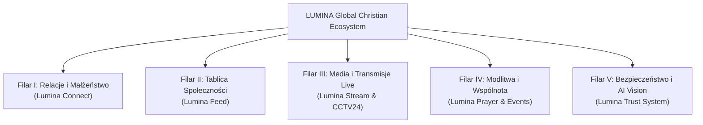

# 🏛️ STATUT I DOKTRYNA GLOBALNEGO PORTALU CHRZEŚCIJAŃSKIEGO LUMINA
## DOKUMENT ARCHITEKTONICZNY DLA UŻYTKU WEWNĘTRZNEGO — POUFNE (DOWÓDZTWO & AGENTURA AI)

---

## I. PREAMBUŁA I MISJA STRATEGICZNA

1. **Cel Istnienia:**
   Portal **LUMINA (Christian Culture)** został powołany do istnienia jako **najwyższej klasy globalny portal chrześcijański, sieć relacji i suwerenny ekosystem medialno-społecznościowy**.
2. **Globalna Alternatywa dla Platform Świeckich:**
   Docelowym przeznaczeniem portalu jest zaoferowanie chrześcijanom w Polsce i na całym świecie pełnowartościowej, czystej, bezpiecznej i technologicznie bezkompromisowej **alternatywy dla wielkich platform świeckich (YouTube, TikTok, Facebook, Instagram, X/Twitter, Tinder/Badoo)**.

---

## II. ZESTAWIENIE ARCHITEKTONICZNO-STRATEGICZNE

| Świecki Odpowiednik | Wypaczenia Świeckiego Świata | Standard i Odpowiedź LUMINA |
| :--- | :--- | :--- |
| **TikTok / Instagram** | Algorytmy uzależniające, próżność, manipulacja dopaminowa, erotyzacja | **Czysty Strumień Wartości:** Słowo Boże, inspirujące rozważania wideo, autentyczne świadectwa, muzyka uwielbienia i głębia wiary. |
| **Facebook / X (Twitter)** | Algorytmy generujące polaryzację, hejt, agresję oraz cenzurę chrześcijańskich wartości | **Tablica Społeczności LUMINA:** Przestrzeń prawdy, wzajemnego szacunku, intencji modlitewnych i budowania relacji. |
| **Tinder / Badoo** | Płytkie traktowanie człowieka ("swipe"), kultura rozwiązłości, samotność | **Lumina Connect:** Trzypoziomowe chrześcijańskie relacje (👋 Poznajmy się • ☕ Kawa • 🕊️ Modlitwa • ❤️ Małżeństwo) oparte na fundamencie Chrystusa. |
| **YouTube** | Agresywna komercjalizacja, świeckie trendy | **Lumina Media & CCTV24:** Transmisje live 24/7, Radio CC, Biblia Śpiewana, nauczania i muzyka uwielbienia. |

---

## III. 5 FILARÓW GLOBALNEGO PORTALU

### 1. Filar I: Relacje, Rodzina i Małżeństwo (Lumina Connect)
- Główny cel to **trwałe, święte małżeństwo** lub **wartościowa przyjaźń**.
- Wyjaśnialny algorytm dopasowania (Explainable AI Match): Wiara 100%, Cel 95%, Wartości 92%, Lokalizacja 90% + sekcja „Co Was łączy”.
- Dyskretne, bezstresowe narzędzia kontaktu: `[👋 Poznajmy się]`, `[☕ Kawa]`, `[🕊️ Modlitwa]`.

### 2. Filar II: Tablica i Świadectwa (Lumina Feed)
- Miejsce dzielenia się wiarą, świadectwami Bożego działania, rozważaniami i wydarzeniami.
- **Pancerna reguła grafik:** Wszystkie grafiki postów wyświetlane są w całości (`object-fit: contain`) bez ucinania wersetów ani napisów.
- Pinned Daily Devotion: Na samej górze pełne rozważanie dnia (Cezary Rogowski — „Dobrze, że jesteś” / Andrzej Thiel — „Cuda Każdego Dnia”).

### 3. Filar III: Strumień Medialny i Live (Lumina Stream)
- Zintegrowane stacje radiowe (Radio CC, Radio Śpiewana Biblia, CCTV24 Worship).
- Płynny streaming audio/wideo w tle bez przerywania nawigacji po portalu.

### 4. Filar IV: Duchowe Wstawiennictwo i Wydarzenia (Lumina Prayer & Events)
- Interaktywne intencje modlitewne z automatycznymi powiadomieniami push.
- Moduł wydarzeń regionalnych (wieczory uwielbienia, spotkania przy kawie, konferencje).

### 5. Filar V: Bezpieczeństwo i Lumina Trust System
- Weryfikacja autentyczności twarzy przez Google Cloud Vision AI (brak botów, memów i fałszywych profili).
- Uwierzytelnianie numerem telefonu SMS.
- Zgodność z unijnymi standardami RODO (art. 9 — dobrowolna zgoda na dane o wyznaniu) oraz DSA (Digital Services Act).

---

## IV. ZASADA DYSKRECJI I KOMUNIKACJI PUBLICZNEJ

- **Dla Użytkowników Zewnętrznych:** Portal prezentuje się przyjaźnie, lekko i gościnnie pod hasłem: *„LUMINA • Chrześcijańska Społeczność Relacji & Wartości”*.
- **Dla Zespołu Inżynierów i AI (Wewnętrznie):** Każdy moduł tworzony jest z najwyższym rygorem inżynieryjnym jako fundament **światowej klasy globalnego chrześcijańskiego giganta technologicznego**.

---

## V. STANDARD „EFEKT WOW” I BEZWZGLĘDNA NIEZAWODNOŚĆ

1. **Zero Poziomego Scrolla:** Perfekcyjne dopasowanie do każdego ekranu smartfona (360–430px) i tabletu.
2. **Błyskawiczne Działanie:** PWA, Service Worker, Cloud Functions, Remote Push Notifications w tle.
3. **Luksusowy Design:** Spójna estetyka Dark Glassmorphism, złote i fioletowe akcenty, brak jakichkolwiek pustych przestrzeni w UI.
4. **Pancerne Bezpieczeństwo Danych:** Izolacja kluczy, ochrona tożsamości użytkowników i suwerenność technologiczna.
